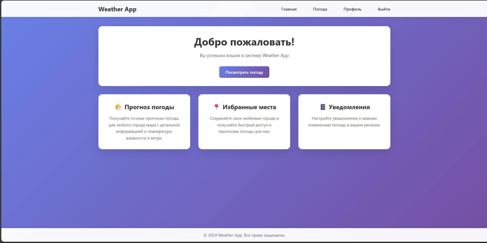
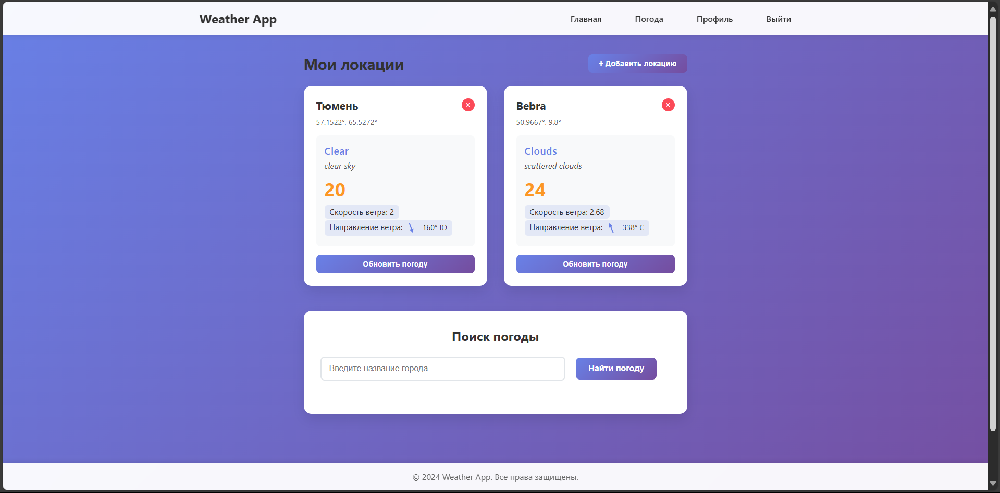
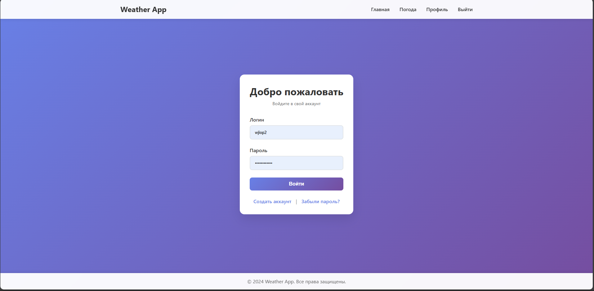
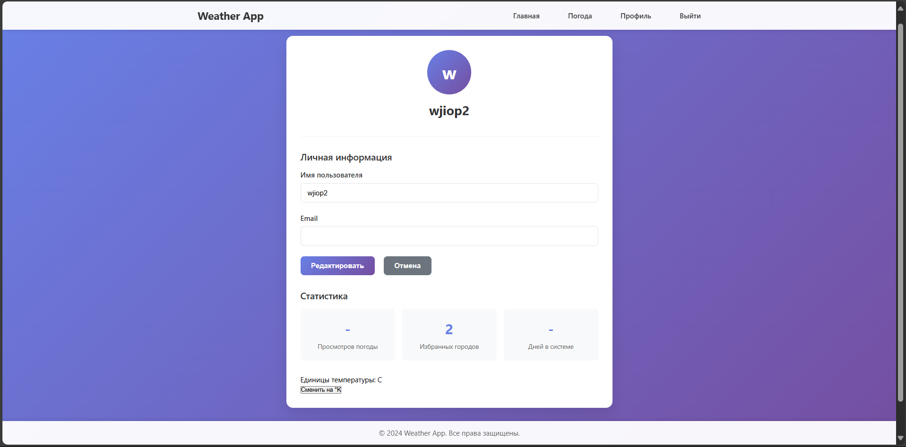
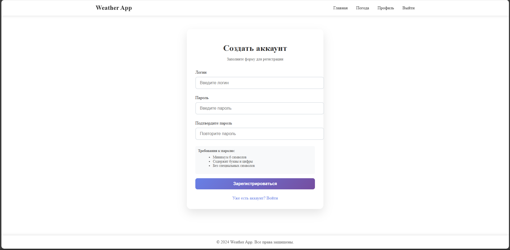

# Weather
Веб-приложение для просмотра текущей погоды.

_Функциональность:_
Приложение отображает погоду для выбранных пользователем локаций.
Для отображения локаций пользователю необходимо зарегистрироваться с произвольным логином, выбрать через поиск и подписаться на необходимые для него локации, после чего прогноз погоды для выбранных локаций будет отображаться на главной странице.

Данные прогноза запрашиваются у сервиса OpenWeatherMap (https://openweathermap.org/) по API.

#### Сервисы приложения для пользователя:
* Регистрация
* Вход в учетную запись
* Выход из учетной записи

#### Сервисы приложения для отображения погоды:
* Поиск локаций
* Добавление локации в список прогноза погоды
* Удаление локации из списка прогноза погоды
* Отображение списка локаций с прогнозом погоды

#### Используемые технологии при разработке:
* Бэк - Java (Gradle, Spring, Lombok, Thymeleaf)
* База данных - Postgres + Hibernate + Liquibase + Docker
